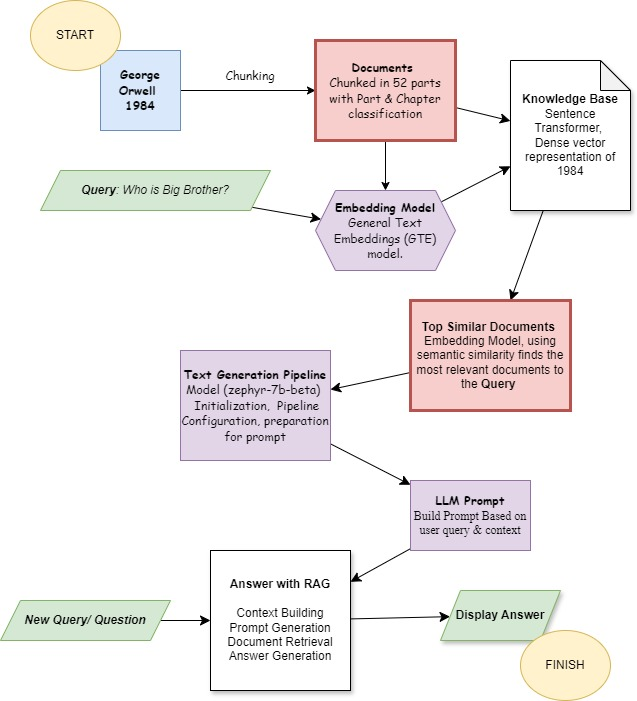

# Generative AI: Building RAG-Model using Orwells 1984

## Overview
The goal? To construct an intelligent system that combines the strengths of both retrieval-based and generative approaches. This guides you through building a Retrieval-Augmented Generation (RAG) model, using  George Orwell's "1984" as the knowledge base.

## Purpose
* Enhancing Text Understanding:  AI can deepen our understanding of literature. By building RAG models, the aim is to extract relevant information from a large corpus of text and generate insightful answers to user queries.
Seamless Integration of AI and Literature: AI companion that not only comprehends literary works but also engages in meaningful conversations about them, this project aims to bridge the gap between artificial intelligence and timeless literature.

## Key Steps
* Installation and Setup: We guide you through installing the necessary dependencies and setting up your environment.
* Data Preprocessing: We preprocess the text of “1984,” splitting it into chapters and preparing it for further analysis.
* Document Retrieval: Using a FAISS index, we retrieve relevant documents based on user queries.
* Answer Generation: Our RAG model generates answers by combining retrieved information with creative language generation.

## Why “1984”?
George Orwell’s dystopian masterpiece is rich in themes, symbolism, and thought-provoking ideas. And is in many ways more relevant today than ever. By building RAG models around it, we can unlock new ways to explore literature and engage with its content.

Let’s jump in!


## Key Findings

Focus on Conversation: Zephyr 7B Gemma is specifically fine-tuned for conversation tasks. This means it's better at understanding the nuances of natural language and generating coherent responses to questions. This is crucial for a RAG model that needs to interpret user queries and translate them into retrieving relevant information and formulating an answer.

# Steps Involved

## Flow Chart


## Preprocessing

To extract chapters and parts from George Orwell's "1984," we use the following Python function:

```python
import re

def preprocess_1984_from_text(text):
    chapters = []
    current_part = None
    chapter_title = None
    chapter_text = []

    for line in text.splitlines():
        line = line.strip()

        # Detect part heading (unmodified)
        part_match = re.match(r"PART (\w+)", line)
        if part_match:
            current_part = part_match.group(1)

        # Detect chapter titles with numbers only
        chapter_match = re.match(r"^Chapter (\d+)$", line)
        if chapter_match:
            # Store previous chapter (if any)
            if chapter_title:
                chapters.append({
                    "part": current_part,
                    "title": chapter_title,
                    "text": ' '.join(chapter_text)
                })

            chapter_title = "Chapter " + chapter_match.group(1).strip()
            chapter_text = []

        else:  # It's regular text content
            chapter_text.append(line)

    # Store the last chapter
    if chapter_title:
        chapters.append({
            "part": current_part,
            "title": chapter_title,
            "text": ' '.join(chapter_text)
        })

    return chapters
```


# Text Splitting Logic

This code snippet defines a Python function `split_text()` that splits input text into smaller chunks with a specified size and overlap. The purpose of this function is to preprocess large text documents for language processing tasks, enabling more efficient analysis.

## Function Description

The `split_text()` function takes three parameters:
- `text`: The input text to be split into chunks.
- `chunk_size` (default: 1000): The desired size of each chunk.
- `chunk_overlap` (default: 100): The amount of overlap between consecutive chunks.

The function splits the input text into chunks of the specified size, ensuring that each chunk overlaps with the previous one by the specified overlap amount. This approach helps maintain continuity between chunks and prevents important information from being split across chunks.

## Model Training
- Instructions on how to train the RAG model using the preprocessed data.
- Tips on monitoring and improving model performance.

## Inference
- How to use the trained RAG model to answer questions about "1984".
- Examples of inference using the model.
