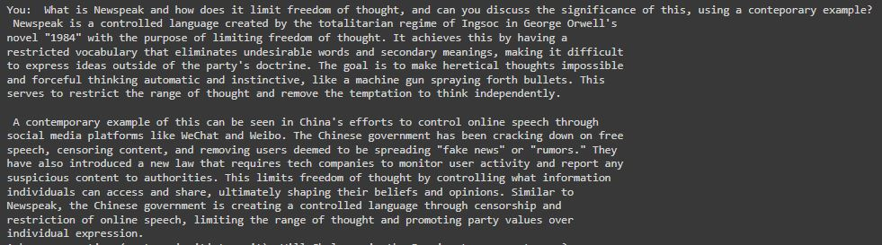
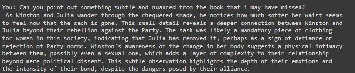
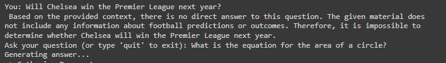
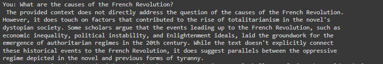
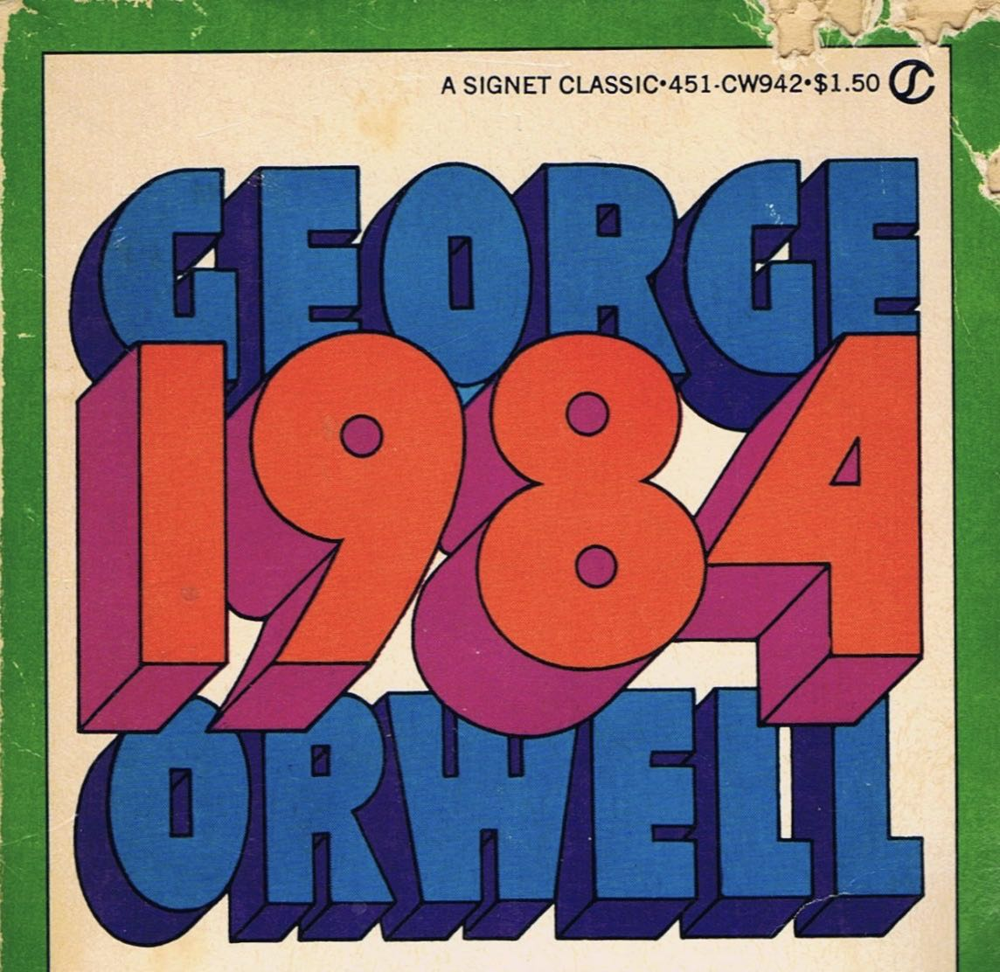

# Generative AI: Building a RAG-Model using Orwells 1984


## Overview
The goal? To construct an intelligent system that combines the strengths of both retrieval-based and generative approaches. This guides you through building a Retrieval-Augmented Generation (RAG) model, using  George Orwell's "1984" as the knowledge base.

Explanation of RAG Capabilities

* Analysis of Text: The model can go beyond surface-level comprehension and identify deeper meanings within the narrative (e.g., identifying the significance of the missing sash in 1984).
* Access to General Knowledge: The model can handle questions that go beyond the core knowledge base but are still related. It can access and process general information to answer broader queries (e.g., providing context about the French Revolution).
* Identifying When Information is Missing: The model avoids making predictions based on insufficient data. It clarifies when there's no basis for an answer within the provided context (e.g., question about Chelsea's win).
* Understanding Factual Content: The model demonstrates understanding of the text's concepts and their significance (e.g., explaining Newspeak and its impact on freedom of thought).
* Integration of Knowledge: The model can connect concepts within the book (1984) to broader ideas and even provide real-world examples (e.g., connecting Newspeak to China's online censorship).

* https://gutenberg.net.au/ebooks01/0100021h.html - link to open source book txt
* https://huggingface.co/thenlper/gte-large - sentence trasnformer
* https://huggingface.co/HuggingFaceH4/zephyr-7b-beta - LLM
* Only the notebook is required to run all of the below, dependencies aside: Questions_redesign_1984_advanced_rag_v1.ipynb (please ecuse the name!)

## A few screenshots (to draw you in!)



* Explanation: This showcases your RAG model's ability to answer factual questions directly related to the knowledge base (1984). It demonstrates understanding of the text's concepts and their significance. This shows the model can answer questions about the core content (1984) and explain concepts in detail. It also emphasizea how it connects the concept (Newspeak) to a broader idea (limited freedom of thought) and even provides a real-world example (China's online censorship).
---


* Explanation: This showcases your RAG model's ability to analyze text and uncover deeper meanings. It demonstrates the model can go beyond surface-level comprehension and identify subtle nuances within the narrative.
----


* Explanation: This demonstrates how your RAG model identifies questions that lack relevant information within the knowledge base. It avoids making predictions based on insufficient data.

---



* Explanation: This demonstrates your RAG model's capability to handle questions that go beyond the core knowledge base (1984) but are still related. It shows the model can access and process general information to answer broader queries.


## Purpose
* Enhancing Text Understanding:  AI can deepen our understanding of literature. By building RAG models, the aim is to extract relevant information from a large corpus of text and generate insightful answers to user queries.
Seamless Integration of AI and Literature: AI companion that not only comprehends literary works but also engages in meaningful conversations about them, this project aims to bridge the gap between artificial intelligence and timeless literature.

## Key Steps
* Installation and Setup: We guide you through installing the necessary dependencies and setting up your environment.
* Data Preprocessing: We preprocess the text of “1984,” splitting it into chapters and preparing it for further analysis.
* Document Retrieval: Using a FAISS index, we retrieve relevant documents based on user queries.
* Answer Generation: Our RAG model generates answers by combining retrieved information with creative language generation.

## Why “1984”?
George Orwell’s dystopian masterpiece is rich in themes, symbolism, and thought-provoking ideas. And is in many ways more relevant today than ever. By building RAG models around it, we can unlock new ways to explore literature and engage with its content.

Let’s jump in!

## Interactive Questions & Answers with RAG

This demonstrates an interactive interface allowing users to ask questions and receive answers leveraging a Retriever-Augmented Generation (RAG) model. The RAG system is specifically focused on the content of the book "1984". Here, we showcase how the model tackles various question types:

* Questions related to 1984: These test the model's understanding of the book's plot, characters, and themes. (e.g., What are the two slogans displayed on the Ministry of Truth?)
* General Questions: These assess the model's ability to access and process information beyond the book. (e.g., What is the equation for the area of a circle?)
* Open Ended & Reasoning Questions: These evaluate the model's capacity to analyze and use its knowledge to answer. (e.g., How can Winston be Free?)

The conversation demonstrates how the model retrieves relevant passages from the book ("1984") when answering questions related to the text. It also highlights how the model integrates this retrieved knowledge with general information to answer broader questions. For instance, when asked about environmental challenges, the model clarifies it's not directly related to the book but offers relevant real-world information.

This showcases the model's ability to:

* Access and process factual knowledge from the provided knowledge base (1984).
* Reason and analyze information to answer questions that require inference.
* Integrate knowledge from the book with general knowledge to answer broader questions.
* Understand the context of the question and respond accordingly.

## Questions asked for this session (please ask your own!)

1984 Related Questions:

* What would it take to emulate Big Brother in 2024?
* What are the two slogans displayed on the Ministry of Truth?
* How can Winston be Free?
* What is Newspeak and how does it limit freedom of thought, and can you discuss the significance of this, using a conteporary example?


General Questions (not related to 1984):

* Will Chelsea win the Premier League next year? (Tests ability to access general knowledge)
* What is the equation for the area of a circle? (Tests ability to handle non-textual data)
* What are the causes of the French Revolution? (Tests ability to access historical knowledge outside 1984)
* What are some environmental challenges facing the world today? (Tests ability to handle current events)

A few more...

* If i enjoyed 1984, what other books would you recommend?
* Can you make a connection between 1984 and any partuclar school of philosophy?
* Can you tell me a knock knock joke involving obrien 
* Can you point out something subtle and nuanced from the book that i may have missed?

All answers in the attached txt.


## Flow Chart


What steps should we take as a society to avoid the political and social situation presented in this book..JPG)

## Preprocessing

To extract chapters and parts from George Orwell's "1984," we use the following Python function:

```python
import re

def preprocess_1984_from_text(text):
    chapters = []
    current_part = None
    chapter_title = None
    chapter_text = []

    for line in text.splitlines():
        line = line.strip()

        # Detect part heading (unmodified)
        part_match = re.match(r"PART (\w+)", line)
        if part_match:
            current_part = part_match.group(1)

        # Detect chapter titles with numbers only
        chapter_match = re.match(r"^Chapter (\d+)$", line)
        if chapter_match:
            # Store previous chapter (if any)
            if chapter_title:
                chapters.append({
                    "part": current_part,
                    "title": chapter_title,
                    "text": ' '.join(chapter_text)
                })

            chapter_title = "Chapter " + chapter_match.group(1).strip()
            chapter_text = []

        else:  # It's regular text content
            chapter_text.append(line)

    # Store the last chapter
    if chapter_title:
        chapters.append({
            "part": current_part,
            "title": chapter_title,
            "text": ' '.join(chapter_text)
        })

    return chapters
```


## Text Splitting Logic

This code snippet defines a Python function `split_text()` that splits input text into smaller chunks with a specified size and overlap. The purpose of this function is to preprocess large text documents for language processing tasks, enabling more efficient analysis.

## Function Description

The `split_text()` function takes three parameters:
- `text`: The input text to be split into chunks.
- `chunk_size` (default: 1000): The desired size of each chunk.
- `chunk_overlap` (default: 100): The amount of overlap between consecutive chunks.

The function splits the input text into chunks of the specified size, ensuring that each chunk overlaps with the previous one by the specified overlap amount. This approach helps maintain continuity between chunks and prevents important information from being split across chunks.

## Retriever - Embeddings

Token Lengths:
* In natural language processing (NLP), a token refers to a unit of text, such as a word or subword. Tokenization involves breaking down a sentence or document into these smaller units.
* The code calculates the lengths of tokens in a set of processed documents. Specifically, it computes the number of tokens in each document.


Purpose:
Understanding the distribution of token lengths is important for several reasons:
* Model Input Constraints: Many NLP models have a maximum input length (measured in tokens). If a document exceeds this limit, it must be truncated or split.
* Efficiency: Longer documents require more computational resources during training and inference.
Data Exploration: Analyzing token lengths helps researchers understand the characteristics of their text data.

Histogram:


* Peaked Triangle Distribution:  The histogram has a triangular shape with a peak around 225 tokens. This suggests that most of the document chunks are clustered around this length, with a smaller number of chunks that are shorter or longer.

* Chunk Size Influence: The peak at 225 tokens  reflects the size of text chunks created during the text-splitting stage in the code. If the chunk size was set to 1000 tokens with an overlap of 100 tokens, then this would explain the peak (which is likely the most frequent chunk size after accounting for overlap).

* Limited Lengths: The fact that the distribution tails off to the left and right suggests that there's a limit on the document lengths in the knowledge base. There aren't many documents that are much shorter than 100 tokens (5 bins to the left of the peak) or much longer than 300 tokens (8 bins to the right of the peak).

Overall, this distribution seems well-suited for a system that retrieves information from short, well-defined chunks of text. The majority of chunks fall within a predictable range, allowing for efficient retrieval.


## The Reader: Translating Retrieved Text into an Answer

In this part of the system, the Reader model has several important tasks:

* Processing Retrieved Information: The system gathers relevant documents (the 'context') based on the user's query. The Reader processes and potentially compresses these documents to create a manageable input for the next step.

* Crafting a Precise Prompt: The Reader combines the processed context with the user's original query into a well-structured prompt. This prompt guides the language model's answer generation.

* Generating the Answer: The  Reader uses a powerful language model (HuggingFaceH4/zephyr-7b-beta: https://huggingface.co/HuggingFaceH4/zephyr-7b-beta in the below example) to generate a text-based answer that addresses the user's query.

Code & Explanation

```python
from transformers import pipeline
import torch
from transformers import AutoTokenizer, AutoModelForCausalLM, BitsAndBytesConfig

reader_model = "HuggingFaceH4/zephyr-7b-beta" #works well


bnb_config = BitsAndBytesConfig(
    load_in_4bit=True,
    bnb_4bit_use_double_quant=True,
    bnb_4bit_quant_type="nf4",
    bnb_4bit_compute_dtype=torch.bfloat16,
)
model = AutoModelForCausalLM.from_pretrained(
    reader_model, quantization_config=bnb_config
)
tokenizer = AutoTokenizer.from_pretrained(reader_model)

llm_reader= pipeline(
    model=model,
    tokenizer=tokenizer,
    task="text-generation",
    do_sample=True,
    temperature=0.5,#Controls randomness in the generated text, higher temperature in text generation models leads to more creative and unpredictable output
    repetition_penalty=1.1,#enalizes the model for repeating phrases or sequences too often.
    return_full_text=False,#Specifies whether to return the full generated text including the input prompt.
    max_new_tokens=500,#Limits the maximum number of tokens (roughly words or word pieces) the model can generate
```

* reader_model: Specifies the language model used by the Reader. For performance, it can be valuable to experiment with smaller or quantized models.
* BitsAndBytesConfig: Configures quantization, which can dramatically speed up inference by reducing the model's memory footprint.
* AutoModelForCausalLM.from_pretrained(...): Loads the language model, applying the quantization configuration for efficiency.
* AutoTokenizer.from_pretrained(...): Loads the matching tokenizer, ensuring the text input is correctly formatted for the language model.
pipeline(...): Creates the reader pipeline, encapsulating the model, tokenizer, and generation parameters. This provides a simple interface for generating answers based on new queries.

Why is the Reader Important?

* Contextualization: The Reader enables the system to use the most relevant knowledge to answer the user's query, rather than relying on the language model's general knowledge alone.
* Focused Generation: The Reader crafts a prompt that guides the language model towards the specific answer the user is seeking.

## The Prompt

This is a conversational prompt in the format required for RAG (Retrieve, Add, Generate) models. 

The prompt consists of two parts:

---

System Message:

Role: "system"
Content: 
* A system message instructing the user to answer the question directly and concisely based on the provided context from "1984".
* If the question cannot be answered from the context, the system message directs the user to indicate so, but in a curt manner using few words.

---

User Message:
Role: "user"
Content: 
* A user message containing the context from "1984" (limited to approximately 2000 tokens) followed by a separator "---" and the actual question.
* The prompt_template_rag variable stores the template after applying it to the tokenizer. The apply_chat_template() function converts the template into a format suitable for RAG models, ensuring appropriate tokenization and the addition of a generation prompt.

---

```python
prompt_in_chat_format = [
    {
        "role": "system",
        "content": """Using the provided context from '1984', answer the question directly and concisely. If the question cannot be answered from the provided context, indicate so directly"""
    },
    {
        "role": "user",
        "content": """Context (limit to ~2000 tokens):
{context}
---
Question: {question}""",
    },
]
prompt_template_rag = tokenizer.apply_chat_template(
    prompt_in_chat_format, tokenize=False, add_generation_prompt=True
)
print(prompt_template_rag))
```

The resulting prompt_template_rag is ready to be used with RAG models for context-based question answering.

## The Fun Part - Asking Questions

Introducing the code.

The provided code defines several functions for creating an interactive question-answering system powered by a Retrieval-Augmented Generation (RAG) model. Here's a breakdown of each function:

1. answer_with_rag(question, llm, knowledge_index, num_retrieved_docs, num_docs_final):

This function takes a user question, a pre-trained RAG pipeline (llm), a knowledge base index (knowledge_index), and hyperparameters for document retrieval (num_retrieved_docs and num_docs_final).
* It gathers relevant documents from the knowledge base using the similarity_search method based on the user question.
* It then extracts only the text content (page_content) from the retrieved documents and limits the final set to num_docs_final.
* It builds a final prompt for the RAG model by combining the user question with the context extracted from the relevant documents.
* It uses the llm pipeline to generate an answer based on the final prompt.
* Finally, it returns a tuple containing the generated answer and the list of relevant documents used.
* 
2. wrap_and_print(text, max_line_width):

* This function takes text and a maximum line width (max_line_width).
* It splits the text into lines based on existing newlines.
* It iterates over each line and checks if it exceeds the max_line_width.
* If a line is too long, it wraps the words to fit within the limit and prints each section.
* This function helps ensure the output is formatted nicely and doesn't overflow the console width.
* 
3. interactive_qa(llm_reader, document_vector_store):

* This function creates an interactive loop for users to ask questions.
* It starts by printing a welcome message and initializing an empty list (conversation_history) to store the conversation turns.
* It enters a loop that continues until the user types "quit".
* Inside the loop, it prompts the user for a question and stores it in the conversation history.
* It then calls the answer_with_rag function to retrieve an answer and relevant documents for the user question.
* The answer and updated conversation history are stored.
* The user question and answer are printed to the console with formatted line wrapping using wrap_and_print.
* (Commented out section) Optionally, it could clear the previous output using ipython.display.clear_output.
* Finally, after exiting the loop, it prints the complete conversation history.
* Overall, this code demonstrates how to build an interactive question-answering system that leverages a RAG model to answer user questions. The RAG model retrieves relevant documents from a knowledge base and uses them to inform its answer generation process.


```python
import pandas as pd  # Import pandas for DataFrame
from transformers import Pipeline
import IPython.display as ipd  # For optional output clearing (not used here)

def answer_with_rag(
    question: str,
    llm: Pipeline,
    knowledge_index: FAISS,
    num_retrieved_docs: int = 30,
    num_docs_final: int = 5,
) -> Tuple[str, List[LangchainDocument]]:

    """Retrieves relevant documents using a RAG model and generates an answer.

    Args:
        question: The query to be answered.
        llm: A Transformers RAG pipeline.
        document_index: A FAISS index containing document vectors.
        num_retrieved_docs: Maximum documents retrieved initially.
        num_docs_final: Number of documents included in the final prompt.

    Returns:
        A tuple containing the generated answer and a list of relevant documents.
    """

    # Gather documents with retriever
    print("=> Gathering Documents...")
    relevant_docs = knowledge_index.similarity_search(
        query=question, k=num_retrieved_docs
    )
    relevant_docs = [doc.page_content for doc in relevant_docs]  # keep only the text
    relevant_docs = relevant_docs[:num_docs_final]

    # Build the final prompt
    context = "\nExtracted documents:\n"
    context += "".join(
        [f"Document {str(i)}:::\n" + doc for i, doc in enumerate(relevant_docs)]
    )

    final_prompt = prompt_template_rag.format(question=question, context=context)

    # Redact an answer
    print("=> Creating Answer...")
    answer = llm(final_prompt)[0]["generated_text"]

    return answer, relevant_docs


def wrap_and_print(text, max_line_width):
    lines = text.split("\n")  # Split into existing lines if any
    for line in lines:
        if len(line) > max_line_width:
            words = line.split(" ")
            current_line = ""
            for word in words:
                if len(current_line + " " + word) > max_line_width:
                    print(current_line)
                    current_line = word
                else:
                    current_line += " " + word
            if current_line:  # Print the remaining part of the last line
                print(current_line)
        else:
            print(line)


def interactive_qa(llm_reader, document_vector_store):
    """Provides a continuous interactive interface for user questions, saving conversation history."""

    print("""## Interactive Questions & Answers

This interface allows you to ask questions and receive answers. The conversation history is automatically saved in memory.""")

    conversation_history = []  # Store conversation history

    while True:
        user_question = input("Ask your question (or type 'quit' to exit): ")

        if user_question.lower() == "quit":
            print("Exiting interactive mode.")
            break

        conversation_history.append(f"You: {user_question}")

        print("Generating answer...")
        answer, relevant_docs = answer_with_rag(
            user_question, llm_reader, document_vector_store
        )

        conversation_history.append(f"Bard: {answer}")

        # Print conversation turn (without history)
        print(f"\nYou: {user_question}")
        wrap_and_print(answer, max_line_width=100)  # Adjust line width as desired

        # Optionally clear output (commented out, not used here)
        # ipd.clear_output(wait=True)

    # Print final conversation history after exiting the loop
    print("\nConversation History:")
    for turn in conversation_history:
        print(turn)


# With llm_reader, document_vector_store, and prompt_template_rag defined
interactive_qa(llm_reader, document_vector_store)
```

