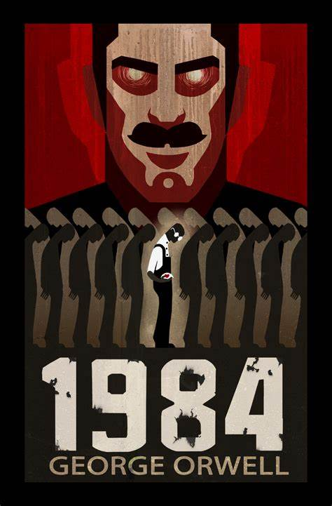

# Generative AI: Building a RAG-Model using Orwells 1984



## Overview
The goal? To construct an intelligent system that combines the strengths of both retrieval-based and generative approaches. This guides you through building a Retrieval-Augmented Generation (RAG) model, using  George Orwell's "1984" as the knowledge base.

## Purpose
* Enhancing Text Understanding:  AI can deepen our understanding of literature. By building RAG models, the aim is to extract relevant information from a large corpus of text and generate insightful answers to user queries.
Seamless Integration of AI and Literature: AI companion that not only comprehends literary works but also engages in meaningful conversations about them, this project aims to bridge the gap between artificial intelligence and timeless literature.

## Key Steps
* Installation and Setup: We guide you through installing the necessary dependencies and setting up your environment.
* Data Preprocessing: We preprocess the text of “1984,” splitting it into chapters and preparing it for further analysis.
* Document Retrieval: Using a FAISS index, we retrieve relevant documents based on user queries.
* Answer Generation: Our RAG model generates answers by combining retrieved information with creative language generation.

## Why “1984”?
George Orwell’s dystopian masterpiece is rich in themes, symbolism, and thought-provoking ideas. And is in many ways more relevant today than ever. By building RAG models around it, we can unlock new ways to explore literature and engage with its content.

Let’s jump in!


## Key Findings

Focus on Conversation: Zephyr 7B Gemma is specifically fine-tuned for conversation tasks. This means it's better at understanding the nuances of natural language and generating coherent responses to questions. This is crucial for a RAG model that needs to interpret user queries and translate them into retrieving relevant information and formulating an answer.

# Steps Involved

## Flow Chart


## Preprocessing

To extract chapters and parts from George Orwell's "1984," we use the following Python function:

```python
import re

def preprocess_1984_from_text(text):
    chapters = []
    current_part = None
    chapter_title = None
    chapter_text = []

    for line in text.splitlines():
        line = line.strip()

        # Detect part heading (unmodified)
        part_match = re.match(r"PART (\w+)", line)
        if part_match:
            current_part = part_match.group(1)

        # Detect chapter titles with numbers only
        chapter_match = re.match(r"^Chapter (\d+)$", line)
        if chapter_match:
            # Store previous chapter (if any)
            if chapter_title:
                chapters.append({
                    "part": current_part,
                    "title": chapter_title,
                    "text": ' '.join(chapter_text)
                })

            chapter_title = "Chapter " + chapter_match.group(1).strip()
            chapter_text = []

        else:  # It's regular text content
            chapter_text.append(line)

    # Store the last chapter
    if chapter_title:
        chapters.append({
            "part": current_part,
            "title": chapter_title,
            "text": ' '.join(chapter_text)
        })

    return chapters
```


## Text Splitting Logic

This code snippet defines a Python function `split_text()` that splits input text into smaller chunks with a specified size and overlap. The purpose of this function is to preprocess large text documents for language processing tasks, enabling more efficient analysis.

## Function Description

The `split_text()` function takes three parameters:
- `text`: The input text to be split into chunks.
- `chunk_size` (default: 1000): The desired size of each chunk.
- `chunk_overlap` (default: 100): The amount of overlap between consecutive chunks.

The function splits the input text into chunks of the specified size, ensuring that each chunk overlaps with the previous one by the specified overlap amount. This approach helps maintain continuity between chunks and prevents important information from being split across chunks.

## Retriever - Embeddings

Token Lengths:
* In natural language processing (NLP), a token refers to a unit of text, such as a word or subword. Tokenization involves breaking down a sentence or document into these smaller units.
* The code calculates the lengths of tokens in a set of processed documents. Specifically, it computes the number of tokens in each document.


Purpose:
Understanding the distribution of token lengths is important for several reasons:
* Model Input Constraints: Many NLP models have a maximum input length (measured in tokens). If a document exceeds this limit, it must be truncated or split.
* Efficiency: Longer documents require more computational resources during training and inference.
Data Exploration: Analyzing token lengths helps researchers understand the characteristics of their text data.

Histogram:


* Peaked Triangle Distribution:  The histogram has a triangular shape with a peak around 225 tokens. This suggests that most of the document chunks are clustered around this length, with a smaller number of chunks that are shorter or longer.

* Chunk Size Influence: The peak at 225 tokens  reflects the size of text chunks created during the text-splitting stage in the code. If the chunk size was set to 1000 tokens with an overlap of 100 tokens, then this would explain the peak (which is likely the most frequent chunk size after accounting for overlap).

* Limited Lengths: The fact that the distribution tails off to the left and right suggests that there's a limit on the document lengths in the knowledge base. There aren't many documents that are much shorter than 100 tokens (5 bins to the left of the peak) or much longer than 300 tokens (8 bins to the right of the peak).

Overall, this distribution seems well-suited for a system that retrieves information from short, well-defined chunks of text. The majority of chunks fall within a predictable range, allowing for efficient retrieval.


## The Reader: Translating Retrieved Text into an Answer

In this part of the system, the Reader model has several important tasks:

* Processing Retrieved Information: The system gathers relevant documents (the 'context') based on the user's query. The Reader processes and potentially compresses these documents to create a manageable input for the next step.

* Crafting a Precise Prompt: The Reader combines the processed context with the user's original query into a well-structured prompt. This prompt guides the language model's answer generation.

* Generating the Answer: The  Reader uses a powerful language model (HuggingFaceH4/zephyr-7b-beta: https://huggingface.co/HuggingFaceH4/zephyr-7b-beta in the below example) to generate a text-based answer that addresses the user's query.

Code & Explanation

```python
from transformers import pipeline
import torch
from transformers import AutoTokenizer, AutoModelForCausalLM, BitsAndBytesConfig

reader_model = "HuggingFaceH4/zephyr-7b-beta" #works well


bnb_config = BitsAndBytesConfig(
    load_in_4bit=True,
    bnb_4bit_use_double_quant=True,
    bnb_4bit_quant_type="nf4",
    bnb_4bit_compute_dtype=torch.bfloat16,
)
model = AutoModelForCausalLM.from_pretrained(
    reader_model, quantization_config=bnb_config
)
tokenizer = AutoTokenizer.from_pretrained(reader_model)

llm_reader= pipeline(
    model=model,
    tokenizer=tokenizer,
    task="text-generation",
    do_sample=True,
    temperature=0.5,#Controls randomness in the generated text, higher temperature in text generation models leads to more creative and unpredictable output
    repetition_penalty=1.1,#enalizes the model for repeating phrases or sequences too often.
    return_full_text=False,#Specifies whether to return the full generated text including the input prompt.
    max_new_tokens=500,#Limits the maximum number of tokens (roughly words or word pieces) the model can generate
```

* reader_model: Specifies the language model used by the Reader. For performance, it can be valuable to experiment with smaller or quantized models.
* BitsAndBytesConfig: Configures quantization, which can dramatically speed up inference by reducing the model's memory footprint.
* AutoModelForCausalLM.from_pretrained(...): Loads the language model, applying the quantization configuration for efficiency.
* AutoTokenizer.from_pretrained(...): Loads the matching tokenizer, ensuring the text input is correctly formatted for the language model.
pipeline(...): Creates the reader pipeline, encapsulating the model, tokenizer, and generation parameters. This provides a simple interface for generating answers based on new queries.

Why is the Reader Important?

* Contextualization: The Reader enables the system to use the most relevant knowledge to answer the user's query, rather than relying on the language model's general knowledge alone.
* Focused Generation: The Reader crafts a prompt that guides the language model towards the specific answer the user is seeking.

## The Prompt

This is a conversational prompt in the format required for RAG (Retrieve, Add, Generate) models. 

The prompt consists of two parts:

---

System Message:

Role: "system"
Content: 
* A system message instructing the user to answer the question directly and concisely based on the provided context from "1984".
* If the question cannot be answered from the context, the system message directs the user to indicate so, but in a curt manner using few words.

---

User Message:
Role: "user"
Content: 
* A user message containing the context from "1984" (limited to approximately 2000 tokens) followed by a separator "---" and the actual question.
* The prompt_template_rag variable stores the template after applying it to the tokenizer. The apply_chat_template() function converts the template into a format suitable for RAG models, ensuring appropriate tokenization and the addition of a generation prompt.

---

```python
prompt_in_chat_format = [
    {
        "role": "system",
        "content": """Using the provided context from '1984', answer the question directly and concisely. If the question cannot be answered from the context, indicate so, but in a curt manner using few words."""
    },
    {
        "role": "user",
        "content": """Context (limit to ~2000 tokens):
{context}
---
Question: {question}""",
    },
]
prompt_template_rag = tokenizer.apply_chat_template(
    prompt_in_chat_format, tokenize=False, add_generation_prompt=True
)
print(prompt_template_rag)
```

The resulting prompt_template_rag is ready to be used with RAG models for context-based question answering.
